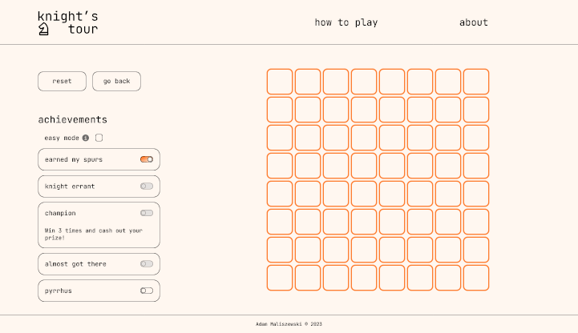

# Knight's Tour

Welcome to Knight's Tour, a game based on a [classic chess puzzle](https://en.wikipedia.org/wiki/Knight%27s_tour).

You can try it [here](https://knightstour.vercel.app/).

## Overview

The app is built with React and Typescript.

It features an interactive UI system that reflects the state of the app, built around three core features:

-   the chessboard state,
-   the user's game statistics,
-   and the achievements system.

The three features are kept in a global store and managed smoothly through a reducer with a set of custom hooks.

### Highlights

-   Basic routing with [React Router](https://reactrouter.com/home).
-   A set of custom UI components, including tooltips, checkboxes, buttons and toggles.
-   An animated [Lottie](https://lottiefiles.com/) logo that reacts dynamically to game state changes.
-   Styling with [Emotion](https://emotion.sh/docs/introduction), enabling dynamic style changes and maintaining a clear, modular and scalable structure.

## Project setup

The project was originally set up with the now-deprecated [Create React App](https://github.com/facebook/create-react-app).
