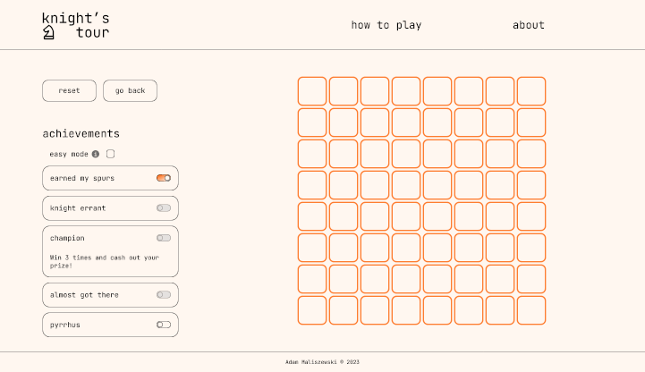

# Knight's Tour

Welcome to Knight's Tour, a game based on a [classic chess puzzle](https://en.wikipedia.org/wiki/Knight%27s_tour).

You can try it [here](https://knightstour.vercel.app/).

## About

The key points of the project, in its current state:

-   a React app
-   state managed smoothly through a global state
-   basic routing with [React Router](https://reactrouter.com/home)
-   components styled with [Emotion](https://emotion.sh/docs/introduction)

## About about

The project was started with the good old [Create React App](https://github.com/facebook/create-react-app), when it was still a recommended method for new React applications. Being one of my earliest truly organised and planned projects, it improved along the way and had its code refactored multiple times. Gradually, it came from a clunky app, coded with no type-safety, 300-line-long components, endless prop drilling and 700-line-long stylesheets to its current state.

Looking back, working on the code and seeing how the tangled spaghetti melted and revealed an organised structure was the most satisfying part of the process, aside from solving the puzzle of how to build and code the logic of the game itself.

## See More

You can learn more about me and see the rest of my projects [here](https://maliszewski.vercel.app/).
